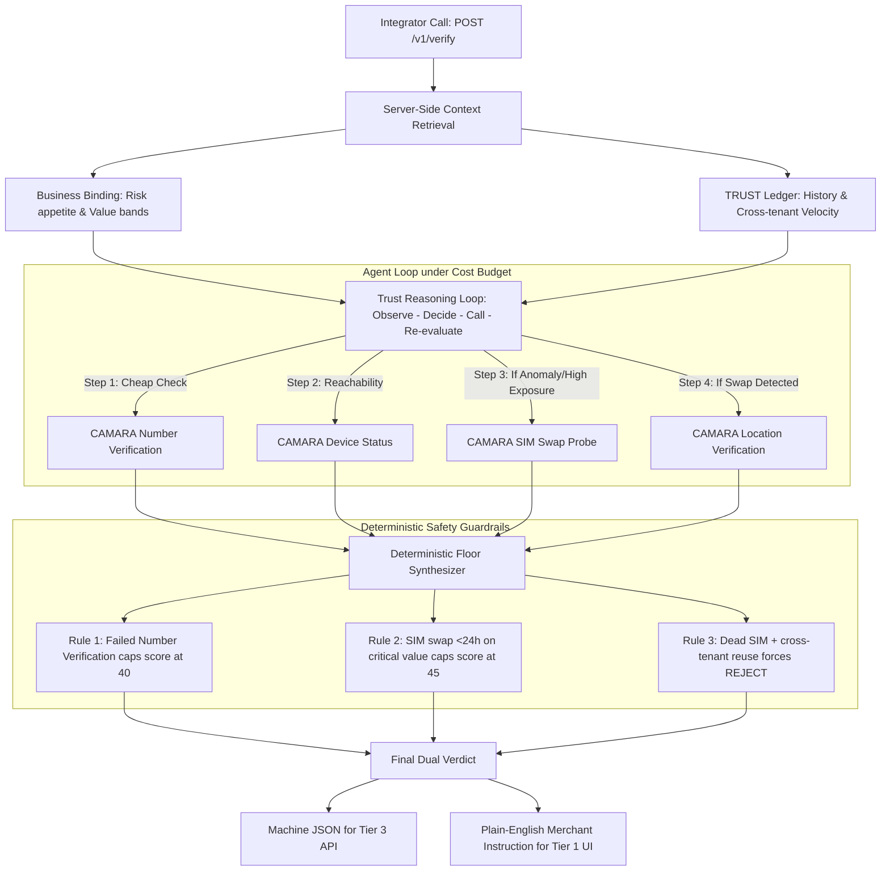

# TRUST · Mobile Network Verification Engine

> **GSMA MENA Ignite Hackathon** · Open Gateway & Nokia Network-as-Code  
> *"One API. The mobile network as the witness neither side of a transaction can fabricate."*

[](https://fastapi.tiangolo.com)
[](https://camaraproject.org/)
[](https://network-as-code.nokia.com/)
[]()

---

## 1. Executive Summary

**TRUST** is an autonomous transaction-verification decision engine designed for banks, e-commerce platforms, and SMEs across the MENA region. 

In cash-on-delivery, informal commerce, and digital lending, card-network fraud tooling fails because transactions settle outside the card rails. Fraudsters exploit OTP interception, SIM swaps, and identity fraud. Conventional fixed-checklist verification either costs too much on low-value transactions or fails to stop coordinated takeovers on high-value ones.

**TRUST replaces rigid checklists with an adaptive AI agent**:
- Integrates all carrier checks behind **one endpoint** (`POST /v1/verify`).
- Allocates a per-transaction **cost-unit budget** based on financial exposure.
- Dynamically selects which mobile network signals (Number Verification, Device Status, SIM Swap, Location, KYC Match, Number Recycling) are worth buying.
- Enforces an **immutable deterministic safety floor** over the AI model's reasoning.

---

## 2. One Engine · Three Front Doors

TRUST delivers identical carrier-grounded protection across three tiers:

| Tier | Target Audience | Integration Model | Interface |
|---|---|---|---|
| **Tier 1: No-Code Playground** | Micro-merchants, local lenders, SME ops teams | Manual data entry / form submission | `/playground` |
| **Tier 2: Platform Plugin** | E-commerce stores (Shopify, WooCommerce, regional platforms) | Webhook trigger on checkout or order placement | Webhook worker hitting `POST /v1/verify` |
| **Tier 3: Developer API & Dashboard** | Commercial banks, fintech wallets, telecom payment rails | REST API (`/v1/verify`) with live/test keys, SDKs | `/dashboard` (auth required) |

---

## 3. The 6 CAMARA Network Tools (Nokia Network-as-Code)

TRUST connects directly to cellular carrier infrastructure via Nokia Network as Code (NaC), querying standardized CAMARA APIs:

1. **Number Verification** (`camara:number-verification:v1` · Cost: 1 unit)  
   Proves the mobile session matches the carrier contract without vulnerable SMS OTPs.
2. **Device Status & Roaming** (`camara:device-status:v1` · Cost: 1 unit)  
   Checks HLR/VLR connectivity to prove a real physical handset is alive and reachable.
3. **SIM Swap Recency Probe** (`camara:sim-swap:v1` · Cost: 2 units)  
   Inspects carrier timestamps for IMSI/ICCID changes within the last 1–7 days.
4. **Device Location Verification** (`camara:device-location:v1` · Cost: 1 unit)  
   Compares the handset's serving cell tower against the delivery or withdrawal address.
5. **Carrier KYC Match** (`camara:kyc-match:v1` · Cost: 2 units)  
   Fuzzy-matches national ID and legal name against regulatory telecom filings.
6. **Number Recycling Check** (`camara:number-recycling:v1` · Cost: 1 unit)  
   Verifies whether an orphaned MSISDN was recently reassigned to a new subscriber.

---

## 4. Decision Engine Architecture



### The Three Override Rules (Deterministic Floor)
1. **Rule 1:** A failed number verification caps the final score at 40, regardless of other passing checks.
2. **Rule 2:** A SIM swap within 24 hours on an elevated or critical transaction caps the score at 44 (or 22 with location contradiction), forcing an automatic `HOLD` or `REJECT`.
3. **Rule 3:** An unreachable device (`>30 days inactive`) with cross-tenant identity reuse triggers an immediate `REJECT`.

### Unavailable-Signal Handling
Every CAMARA call in `internal/agent/reason.py` goes through one choke point (`_call_signal`) that
catches a carrier timeout/error (`CamaraUnavailableError`) and always emits a `SignalResult` with
`status: "uncertain"` — never a silent pass. `internal/verdict/synthesize.py` penalizes uncertainty
proportional to the signal's weight and downgrades `confidence` one notch, so the rule can't be
missed on any one of the six tools. Exhausting the cost budget before every available signal is
bought does the same. Trigger it in the sandbox with MSISDN `+213999000111`.

### Webhook Delivery
`POST /v1/verify` fires `verdict.created` to every webhook registered for the transaction's tenant
as a FastAPI background task right after the response is built — delivery never adds latency to the
verification call itself. Outcomes (delivered/failed, HTTP status, timestamp) are recorded per
webhook and readable at `GET /v1/webhooks/{id}/deliveries`; a failed delivery is logged, not retried.

---

## 5. Scripted Benchmark Scenarios

Pre-configured scenarios located in [`scenarios/`](./scenarios/):

### [Scenario A: Routine Payroll Payment](./scenarios/scenario_a_routine.json)
- **Context:** 42,000 DZD monthly payroll to employee seen since March 2024.
- **Reasoning:** 2 cheap checks confirm active session and live handset.
- **Result:** `APPROVE` (Score: 95/100 · Spent 2/3 cost units).

### [Scenario B: Account Takeover via SIM Swap](./scenarios/scenario_b_escalation.json)
- **Context:** 184,000 DZD order (91% balance) to unfamiliar counterparty. Valid password.
- **Reasoning:** High risk justifies expensive checks. Network flags SIM swap 14h ago and physical handset 412 km away from Oran delivery address.
- **Result:** `HOLD` (Score: 22/100 · Spent 6/8 cost units). Instruction: *"Order #88213 — do not ship yet. Confirm by secondary phone."*

### [Scenario C: Malicious Merchant Fakes a Verification](./scenarios/scenario_c_fake_check.json)
- **Context:** Business submits forged customer profile via manual entry.
- **Reasoning:** Ledger reveals MSISDN submitted 4x under different names. Network reveals dead SIM (inactive >30 days) and recycled number.
- **Result:** `REJECT` (Score: 6/100 · Spent 4/8 cost units). Typing plausible data cannot manufacture live carrier attestation.

---

## 6. Repository Structure

```
TrustGSMA_MENA_Ignite/
│
├── index.html                     # Built static output of frontend/ (checked in for zero-build hosting)
├── assets/                        # Built JS/CSS bundle (same build)
├── vercel.json                    # SPA rewrite rule for the React Router routes
│
├── frontend/                      # Vite + React + Tailwind site (source of truth)
│   ├── src/
│   │   ├── AppRoutes.jsx          # Route table for every page below
│   │   ├── layouts/               # MarketingLayout, DocsLayout, AuthLayout, DashboardLayout
│   │   ├── pages/                 # Public pages: Home, HowItWorks, Pricing, Playground, Login, Signup, …
│   │   │   ├── docs/               # /docs, /docs/quickstart, /docs/api-reference, /docs/tools
│   │   │   └── dashboard/          # /dashboard/* — Tier 3 authenticated console
│   │   ├── sections/               # Landing-page sections (Hero, CaseFiles, HowItDecides, …)
│   │   ├── components/             # Shared UI (WaveCanvas, CodeBlock, RequireAuth, …)
│   │   └── lib/                    # api.js (backend client), AuthContext.jsx, trace.js
│   └── .env                        # VITE_API_BASE_URL — points the frontend at the FastAPI backend
│
├── backend/
│   ├── requirements.txt           # FastAPI, Uvicorn, Pydantic, HTTPX dependencies
│   ├── .env.example               # Nokia NaC credentials & server configuration
│   └── app/
│       ├── main.py                # FastAPI entrypoint (CORS, router mounts)
│       ├── schemas.py             # Contracts: TransactionEvent, Binding, Verdict, Auth
│       ├── api/v1/
│       │   ├── auth.py            # signup/login/me + live/test API keys + key rotation
│       │   ├── verify.py          # POST /v1/verify (core decision endpoint)
│       │   ├── business_bindings.py # CRUD for tenant risk context
│       │   ├── transactions.py    # Past verdict queries and replay
│       │   ├── tools.py           # Read-only public tool registry
│       │   └── webhooks.py        # Register endpoints + real HTTP delivery + delivery logs
│       └── internal/
│           ├── agent/
│           │   └── reason.py      # Reasoning loop: budget enforcement + unavailable-signal handling
│           ├── camara/
│           │   └── tools.py       # Nokia NaC CAMARA client wrappers (+ simulated carrier timeout)
│           ├── history/
│           │   └── ledger.py      # Independent counterparty ledger
│           └── verdict/
│               └── synthesize.py  # Signal weights, deterministic floor, uncertainty penalty
│
└── scenarios/
    ├── scenario_a_routine.json    # Benchmark A: Routine payroll
    ├── scenario_b_escalation.json # Benchmark B: SIM swap takeover
    └── scenario_c_fake_check.json # Benchmark C: Malicious fake check
```

Every page and route above is scoped and tagged (`[DEMO]` / `[SITE]` / `[LATER]`) against
`TRUST_Website_API_Route_Guide.pdf` — the sidebar in `/dashboard` shows each route's tag inline.

---

## 7. Quickstart & Local Setup

### 1. Run the Backend API Server
```bash
cd backend
python -m venv venv
# Windows:
.\venv\Scripts\activate
# Linux/macOS:
source venv/bin/activate

pip install -r requirements.txt
uvicorn app.main:app --reload --port 8000
```
- Interactive Swagger UI: [http://localhost:8000/docs](http://localhost:8000/docs)
- API Health Check: [http://localhost:8000/](http://localhost:8000/)
- Demo login: `demo@trust.dz` / `trust-demo` (seeded, tied to `bb_default_retail`)

### 2. Run the Frontend (dev mode, hot reload)
```bash
cd frontend
npm install
npm run dev
```
Vite reads `frontend/.env` for `VITE_API_BASE_URL` (defaults to `http://localhost:8000`). Open the
printed local URL — every route in Section 1/2/3 of the route guide is live: `/`, `/how-it-works`,
`/docs`, `/playground`, `/login`, `/signup`, `/dashboard/*` (auth-gated).

To view the checked-in static build instead (no Node needed), open `index.html` at the repo root or
serve the folder:
```bash
python -m http.server 3000
```
Rebuilding after a frontend change: `cd frontend && npm run build` outputs to `../dist`; copy
`dist/index.html`, `dist/assets/`, and `dist/favicon.svg` over the same-named files/folders at the
repo root to redeploy the static copy.

### 3. Test `POST /v1/verify` via cURL
```bash
curl -X POST http://localhost:8000/v1/verify \
  -H "Content-Type: application/json" \
  -d '{
    "event_type": "order_placement",
    "amount": { "value": 184000, "currency": "DZD" },
    "counterparty": {
      "msisdn": "+213661448899",
      "declared_name": "Yacine Mansouri",
      "declared_location": { "cell": "31-ORN", "label": "Oran" }
    },
    "channel": "api",
    "idempotency_key": "ord_88213",
    "business_binding_id": "bb_ecommerce_store_02"
  }'
```

---

## 8. Judging Criteria Alignment

| Criteria | How TRUST Addresses It |
|---|---|
| **Relevance** | Targets cash-on-delivery and informal commerce in MENA where card networks don't exist. Directly leverages Open Gateway & Nokia Network as Code. |
| **Impact** | Scale as infrastructure: one endpoint serves a micro-merchant doing 5 orders/day and a commercial bank doing 5,000 orders/day identically. |
| **Innovation** | Autonomous selection and correlation under cost budgets instead of dumb checklists. Scenario B proves how three individually inconclusive checks become decisive in correlation. |
| **Implementation** | Declared CAMARA tool registry, bounded loop with budget decrementation, deterministic override safety floor, and full anti-tampering boundary. |

---
*Built for the GSMA MENA Ignite Hackathon · 2026*
