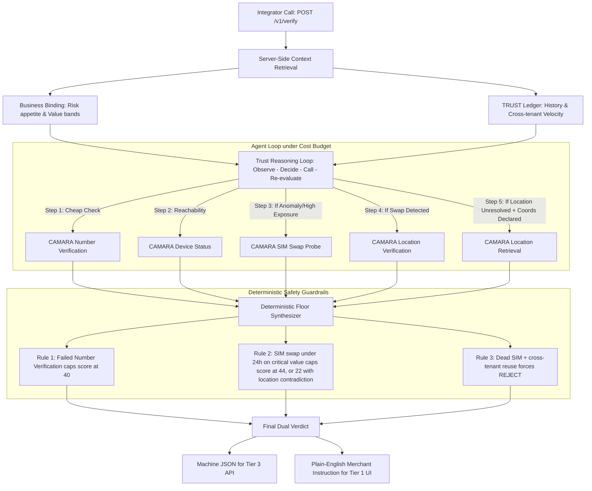

# TRUST · Mobile Network Verification Engine

> **GSMA MENA Ignite Hackathon** · Open Gateway & Nokia Network-as-Code  
> *"One API. The mobile network as the witness neither side of a transaction can fabricate."*

[](https://fastapi.tiangolo.com)
[](https://camaraproject.org/)
[](https://network-as-code.nokia.com/)
[]()

---

## 1. Executive Summary

**TRUST** is an autonomous transaction-verification decision engine designed for banks, e-commerce platforms, and SMEs across the MENA region. 

In cash-on-delivery, informal commerce, and digital lending, card-network fraud tooling fails because transactions settle outside the card rails. Fraudsters exploit OTP interception, SIM swaps, and identity fraud. Conventional fixed-checklist verification either costs too much on low-value transactions or fails to stop coordinated takeovers on high-value ones.

**TRUST replaces rigid checklists with an adaptive AI agent**:
- Integrates all carrier checks behind **one endpoint** (`POST /v1/verify`).
- Allocates a per-transaction **cost-unit budget** based on financial exposure.
- Dynamically selects which of **seven** mobile network signals (Number Verification, Device Status,
  SIM Swap, Location Verification, Location Retrieval, KYC Match, Number Recycling) are worth buying —
  an LLM planner chooses turn by turn, falling back to a fixed decision tree if the model is
  unavailable.
- Enforces an **immutable deterministic safety floor** over the AI model's reasoning: the model
  chooses *which signals to buy* and never computes the score or the decision.

---

## 2. One Engine · Three Front Doors

TRUST delivers identical carrier-grounded protection across three tiers:

| Tier | Target Audience | Integration Model | Interface |
|---|---|---|---|
| **Tier 1: No-Code Playground** | Micro-merchants, local lenders, SME ops teams | Manual data entry / form submission | `/playground` |
| **Tier 2: Platform Plugin** | E-commerce stores (Shopify, WooCommerce, regional platforms) | Webhook trigger on checkout or order placement | Webhook worker hitting `POST /v1/verify` |
| **Tier 3: Developer API & Dashboard** | Commercial banks, fintech wallets, telecom payment rails | REST API (`/v1/verify`) with live/test keys, SDKs | `/dashboard` (auth required) |

---

## 3. The 7 CAMARA Network Tools (Nokia Network-as-Code)

TRUST connects directly to cellular carrier infrastructure via Nokia Network as Code (NaC), querying standardized CAMARA APIs:

1. **Number Verification** (`camara:number-verification:v1` · Cost: 1 unit)  
   Proves the mobile session matches the carrier contract without vulnerable SMS OTPs.
2. **Device Status & Roaming** (`camara:device-status:v1` · Cost: 1 unit)  
   Checks HLR/VLR connectivity to prove a real physical handset is alive and reachable.
3. **SIM Swap Recency Probe** (`camara:sim-swap:v1` · Cost: 2 units)  
   Inspects carrier timestamps for IMSI/ICCID changes within the last 1–7 days.
4. **Device Location Verification** (`camara:device-location:v1` · Cost: 1 unit)  
   Compares the handset's serving cell tower against the delivery or withdrawal address.
5. **Device Location Retrieval** (`camara:location-retrieval:v1` · Cost: 2 units)  
   Returns the handset's actual network-derived position plus an accuracy radius, instead of a
   yes/no answer about a declared area. Bought when verification can't settle the question — no
   coordinate was declared, or verification failed on an elevated amount and the *size* of the
   discrepancy is what decides between a customer one street away and a handset in another wilaya.
   Requires `declared_location.latitude`/`longitude` on the request to compute a `delta_km`.
6. **Carrier KYC Match** (`camara:kyc-match:v1` · Cost: 2 units)  
   Fuzzy-matches national ID and legal name against regulatory telecom filings.
7. **Number Recycling Check** (`camara:number-recycling:v1` · Cost: 1 unit)  
   Verifies whether an orphaned MSISDN was recently reassigned to a new subscriber.

### Live calls vs. sandbox simulator
Four of the seven — **SIM Swap**, **Location Verification**, **Location Retrieval**, and **KYC
Match** — have a direct synchronous CAMARA endpoint and are issued live through Nokia's
`network_as_code` SDK whenever `MOCK_CARRIER_MODE=false` and an API key is present. The other three
have no server-to-server synchronous equivalent in NaC today: Number Verification requires the
end-user's own device to complete an operator consent round trip (implemented separately at
`/v1/number-verification/start`, with live results cached and reused), Device Reachability is
subscription + webhook based rather than request/response, and Number Recycling has no published
endpoint at all. Those three run on the deterministic simulator so demo scenarios stay reproducible.

Every live call is wrapped so a carrier error surfaces as `CamaraUnavailableError` → the signal is
scored **`uncertain`**, never a silent pass.

---

## 4. Decision Engine Architecture



### The Three Override Rules (Deterministic Floor)
1. **Rule 1:** A failed number verification caps the final score at 40, regardless of other passing checks.
2. **Rule 2:** A SIM swap within 24 hours on a critical-value transaction caps the score at 44 — or at
   22 when a location signal also contradicts the declared position — forcing an automatic `HOLD` or
   `REJECT`. The cap only ever *lowers* a score: evidence that already drove the score below the cap
   keeps its lower value, and the rule is recorded as fired either way.
3. **Rule 3:** An unreachable device (`>30 days inactive`) with cross-tenant identity reuse triggers an immediate `REJECT`.

### Unavailable-Signal Handling
Every CAMARA call — in the fixed agent (`internal/agent/reason.py`) and the LLM planner
(`internal/agent/llm_agent.py`) alike — goes through one choke point (`_call_signal`) that
catches a carrier timeout/error (`CamaraUnavailableError`) and always emits a `SignalResult` with
`status: "uncertain"` — never a silent pass. `internal/verdict/synthesize.py` penalizes uncertainty
proportional to the signal's weight and downgrades `confidence` one notch, so the rule can't be
missed on any one of the seven tools. Exhausting the cost budget before every available signal is
bought does the same. Trigger it in the sandbox with MSISDN `+213999000111`.

### Webhook Delivery
`POST /v1/verify` fires `verdict.created` to every webhook registered for the transaction's tenant
as a FastAPI background task right after the response is built — delivery never adds latency to the
verification call itself. Outcomes (delivered/failed, HTTP status, timestamp) are recorded per
webhook and readable at `GET /v1/webhooks/{id}/deliveries`; a failed delivery is logged, not retried.

---

## 5. Scripted Benchmark Scenarios

Pre-configured scenarios live in [`scenarios/`](./scenarios/). Each file carries its own
`expected_verdict` / `expected_units`, and a harness replays all of them through the real engine:

```bash
cd backend && python verify_scenarios.py
```

```
PASS SCENARIO_A   APPROVE  score=100 units=4/5 signals=3 rule=-
PASS SCENARIO_B   HOLD     score= 22 units=5/8 signals=4 rule=RULE_2: Recent SIM swap under 24h ...
PASS SCENARIO_C   REJECT   score=  6 units=7/8 signals=5 rule=RULE_3: Unreachable device with ...
```

It runs in-process against the deterministic mock carrier — no server and no Nokia credentials
needed — and exits non-zero if any scenario stops matching, so the numbers below can't silently drift
from the engine.

### [Scenario A: Routine Payroll Payment](./scenarios/scenario_a_routine.json)
- **Context:** 42,000 DZD monthly payroll to an employee seen since March 2024.
- **Reasoning:** Cheap checks confirm an active session and a live handset; the SIM-swap probe comes
  back clean and the agent stops rather than spending the rest of its budget.
- **Result:** `APPROVE` · score 100 · 4 of 5 cost units · 3 signals.

### [Scenario B: Account Takeover via SIM Swap](./scenarios/scenario_b_escalation.json)
- **Context:** 184,000 DZD order (91% of balance) to an unfamiliar counterparty. Valid password.
- **Reasoning:** High exposure justifies expensive checks. The network flags a SIM swap 14h ago and a
  handset 412 km from the declared Oran delivery address — two individually survivable signals that
  are decisive in correlation.
- **Result:** `HOLD` · score 22 · 5 of 8 cost units · **Rule 2 fired**. Instruction: *"Do not dispatch
  goods or release funds. Contact the verified customer via a secondary confirmed channel."*

### [Scenario C: Malicious Merchant Fakes a Verification](./scenarios/scenario_c_fake_check.json)
- **Context:** A micro-lender's onboarding flow receives a forged customer profile via manual entry.
- **Reasoning:** The ledger reveals the MSISDN submitted across multiple tenants; the network reveals
  no active authentication, a dead SIM (inactive >30 days), a recycled number, and a KYC mismatch.
- **Result:** `REJECT` · score 6 · 7 of 8 cost units · **Rule 3 fired**. Typing plausible data cannot
  manufacture live carrier attestation.

### Location Retrieval in isolation
Scenario B decides on cell-level evidence alone. Supply declared coordinates for the same
counterparty (Playground scenario **G**) and the agent additionally buys Location Retrieval, measures
the handset's real position 351 km from the declared point, and the case moves from `HOLD` to
`REJECT` — the distinction Location *Verification* alone cannot draw.

---

## 6. Repository Structure

```
TrustGSMA_MENA_Ignite/
│
├── index.html                     # Built static output of frontend/ (checked in for zero-build hosting)
├── assets/                        # Built JS/CSS bundle (same build)
├── vercel.json                    # SPA rewrite rule for the React Router routes
│
├── frontend/                      # Vite + React + Tailwind site (source of truth)
│   ├── src/
│   │   ├── AppRoutes.jsx          # Route table for every page below
│   │   ├── layouts/               # MarketingLayout, DocsLayout, AuthLayout, DashboardLayout
│   │   ├── pages/                 # Public pages: Home, HowItWorks, Pricing, Playground, Login, Signup, …
│   │   │   ├── docs/               # /docs, /docs/quickstart, /docs/api-reference, /docs/tools
│   │   │   └── dashboard/          # /dashboard/* — Tier 3 authenticated console
│   │   ├── sections/               # Landing-page sections (Hero, CaseFiles, HowItDecides, …)
│   │   ├── components/             # Shared UI (WaveCanvas, CodeBlock, RequireAuth, …)
│   │   └── lib/                    # api.js (backend client), AuthContext.jsx, trace.js
│   └── .env                        # VITE_API_BASE_URL — points the frontend at the FastAPI backend
│
├── backend/
│   ├── requirements.txt           # FastAPI, Uvicorn, Pydantic, HTTPX, Nokia NaC SDK
│   ├── verify_scenarios.py        # Replays scenarios/ through the engine; exits non-zero on drift
│   ├── .env.example               # Nokia NaC + OpenRouter credentials & server configuration
│   └── app/
│       ├── main.py                # FastAPI entrypoint (CORS, router mounts)
│       ├── config.py              # Central env-backed settings (carrier, LLM, feature toggles)
│       ├── schemas.py             # Contracts: TransactionEvent, Binding, Verdict, Auth
│       ├── api/v1/
│       │   ├── auth.py            # signup/login/me + live/test API keys + key rotation
│       │   ├── verify.py          # POST /v1/verify (core decision endpoint) + idempotency cache
│       │   ├── business_bindings.py # CRUD for tenant risk context
│       │   ├── transactions.py    # Past verdict queries and replay
│       │   ├── tools.py           # Read-only public tool registry
│       │   ├── number_verification.py # 3-legged OAuth consent flow for Number Verification
│       │   └── webhooks.py        # Register endpoints + real HTTP delivery + delivery logs
│       └── internal/
│           ├── agent/
│           │   ├── reason.py      # Fixed decision tree: budget enforcement + unavailable-signal handling
│           │   ├── llm_agent.py   # LLM planner (OpenRouter function calling) over the same tools
│           │   └── explain.py     # Plain-language merchant narrative (PII-sanitized prompt)
│           ├── camara/
│           │   ├── tools.py       # Nokia NaC CAMARA client wrappers (+ simulated carrier timeout)
│           │   └── number_verification_flow.py # Device-side consent round trip + result cache
│           ├── history/
│           │   └── ledger.py      # Independent counterparty ledger
│           └── verdict/
│               └── synthesize.py  # Signal weights, deterministic floor, uncertainty penalty
│
└── scenarios/
    ├── scenario_a_routine.json    # Benchmark A: Routine payroll
    ├── scenario_b_escalation.json # Benchmark B: SIM swap takeover
    └── scenario_c_fake_check.json # Benchmark C: Malicious fake check
```

Surfaces deliberately out of scope for the hackathon build (currently `/dashboard/usage`) render
through `components/LaterStub.jsx`, so a planned-but-unbuilt page is labelled as such rather than
looking broken.

---

## 7. Quickstart & Local Setup

### 1. Run the Backend API Server
```bash
cd backend
python -m venv venv
# Windows:
.\venv\Scripts\activate
# Linux/macOS:
source venv/bin/activate

pip install -r requirements.txt
uvicorn app.main:app --reload --port 8000
```
- Interactive Swagger UI: [http://localhost:8000/docs](http://localhost:8000/docs)
- API Health Check: [http://localhost:8000/](http://localhost:8000/)
- Demo login: `demo@trust.dz` / `trust-demo` (seeded, tied to `bb_default_retail`)

### 2. Run the Frontend (dev mode, hot reload)
```bash
cd frontend
npm install
npm run dev
```
Vite reads `frontend/.env` for `VITE_API_BASE_URL` (defaults to `http://localhost:8000`). Open the
printed local URL — every route in Section 1/2/3 of the route guide is live: `/`, `/how-it-works`,
`/docs`, `/playground`, `/login`, `/signup`, `/dashboard/*` (auth-gated).

To view the checked-in static build instead (no Node needed), open `index.html` at the repo root or
serve the folder:
```bash
python -m http.server 3000
```
Rebuilding after a frontend change: `cd frontend && npm run build` outputs to `../dist`; copy
`dist/index.html`, `dist/assets/`, and `dist/favicon.svg` over the same-named files/folders at the
repo root to redeploy the static copy.

### 3. Test `POST /v1/verify` via cURL
```bash
curl -X POST http://localhost:8000/v1/verify \
  -H "Content-Type: application/json" \
  -d '{
    "event_type": "order_placement",
    "amount": { "value": 184000, "currency": "DZD" },
    "counterparty": {
      "msisdn": "+213661448899",
      "declared_name": "Yacine Mansouri",
      "declared_location": {
        "cell": "31-ORN",
        "label": "Oran",
        "latitude": 35.6971,
        "longitude": -0.6308
      }
    },
    "channel": "api",
    "idempotency_key": "ord_88213",
    "business_binding_id": "bb_ecommerce_store_02"
  }'
```
`declared_location.latitude`/`longitude` are optional. Supplying them unlocks **Location Retrieval** —
without a coordinate to measure against, the agent withholds that tool rather than spending 2 units on
a question it cannot answer.

### 4. Replay the benchmark scenarios
```bash
cd backend && python verify_scenarios.py
```
Runs all three scenarios through the engine in-process and checks each against its expected verdict.
No server and no carrier credentials required.

### Configuration notes
- **`MOCK_CARRIER_MODE=true`** (default) runs the deterministic sandbox simulator, so every demo is
  reproducible without Nokia credentials. Set it to `false` with a real `NOKIA_NAC_API_KEY` to issue
  live CAMARA calls; an unknown MSISDN or a carrier error then degrades to `uncertain` rather than
  silently passing.
- **`LLM_AGENT_ENABLED=true`** with an `OPENROUTER_API_KEY` lets the LLM planner choose signals. With
  no key, or on any provider error before the first signal is bought, the engine falls back to the
  fixed decision tree — a verify call never hard-fails on an LLM outage.

---

## 8. API Surface

Full interactive docs at `http://localhost:8000/docs` once the backend is running.

| Method | Route | Purpose |
|---|---|---|
| `POST` | `/v1/verify` | **Core decision endpoint.** Body is the transaction event only; binding and counterparty history are resolved server-side and never accepted from the caller. Idempotent per `(binding, idempotency_key)`. |
| `GET` | `/v1/counterparty-history/{msisdn}` | Read-only preview of the same ledger the agent reasons from. |
| `GET` | `/v1/tools` | The seven-tool CAMARA registry (id, standard, cost, what it proves). |
| `GET` `POST` | `/v1/business-bindings` | List / create tenant risk context. |
| `GET` `PATCH` | `/v1/business-bindings/{id}` | Read / update a binding. |
| `GET` | `/v1/transactions` · `/v1/transactions/{id}` | Past verdicts and replay. |
| `POST` `GET` | `/v1/auth/signup` · `/login` · `/me` | Tier 3 console auth. |
| `GET` `POST` | `/v1/auth/keys` · `/v1/auth/keys/rotate` | Live/test API keys and rotation. |
| `GET` `POST` | `/v1/webhooks` | Register endpoints for `verdict.created`. |
| `GET` | `/v1/webhooks/{id}/deliveries` | Per-webhook delivery log (status, HTTP code, timestamp). |
| `GET` | `/v1/number-verification/start` · `/redirect` | 3-legged operator consent flow for Number Verification. |

### Anti-tampering boundary
`POST /v1/verify` accepts **only** the transaction event. The business binding (risk appetite, value
bands) and the counterparty ledger (prior verdicts, cross-tenant velocity) are both fetched
server-side, so a caller cannot improve its own verdict by claiming a friendlier risk policy or a
cleaner history. The response echoes back the `counterparty_history` the agent actually used, so an
integrator can audit what evidence drove the decision.

---

## 9. Judging Criteria Alignment

| Criteria | How TRUST Addresses It |
|---|---|
| **Relevance** | Targets cash-on-delivery and informal commerce in MENA where card networks don't exist. Directly leverages Open Gateway & Nokia Network as Code. |
| **Impact** | Scale as infrastructure: one endpoint serves a micro-merchant doing 5 orders/day and a commercial bank doing 5,000 orders/day identically. |
| **Innovation** | Autonomous selection and correlation under cost budgets instead of dumb checklists. Scenario B proves how individually survivable signals become decisive in correlation; Location Retrieval is bought only when Location Verification's yes/no answer cannot settle the case. |
| **Implementation** | Declared 7-tool CAMARA registry, bounded loop with budget decrementation, deterministic override safety floor, full anti-tampering boundary, and a reproducible scenario harness (`backend/verify_scenarios.py`) that fails loudly if behaviour drifts. |

---
*Built for the GSMA MENA Ignite Hackathon · 2026*
